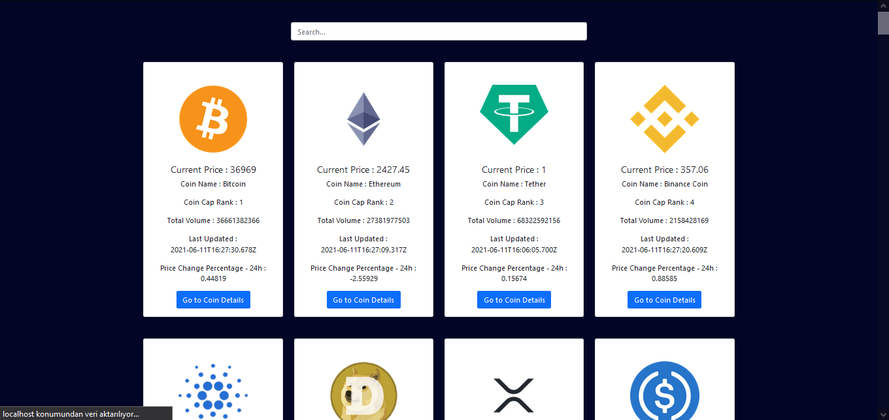
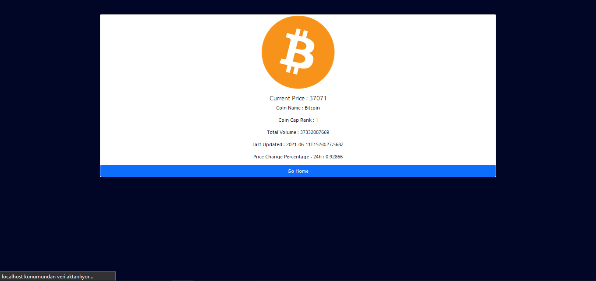

## NETLIFY DEMO
[NETLIFY DEMO - CLICK ](https://crypto-oguzcanuzunoner.netlify.app/)

# Kripto Para Bilgilendirme Uygulaması

Uygulamamızda, API'den çekilen kripto para bilgilerini listeliyoruz. Search kısmını kullanarak da arama işleminizi gerçekeltirebiliyorsunuz.

## Proje Hakkında

Bu projede, Ana sayfada bütün kripto paraların güncel bilgilerine erişebilirsiniz. Bu bilgiler API'den çekilmektedir. Sayfanın üst kısmındaki search barından ise aramak istediğiniz kripto paranın adını yazabilirsiniz. Her kripto paranın altındaki "Go to Coin Details" butonuna bastığınızda ise o kripto paraya ait detay sayfasına yönelndirilirsiniz.

## Proje Teknik Bilgileri

* Dinamik Url yapısı için React-Router-Dom kullanılmıştır.
* Bilgiler API'den çekilmiştir. Bunun için CoinGecko kullanılmıştır.
* API'den veri çekmek için AXIOS kullanılmıştır.
* API bir kere çekilmiş olup, context yapısı ile gerekli sayfalarda kullanılmıştır.
* Sayfa görüntüsü Bootstrap kütüphanesi ile yapılmıştır.

## Proje Nasıl Çalıştırılır

- Projeyi fork'ladıktan ya da indirdikten sonra projenin bulunduğu klasörde "npm install" komutu ile gerekli paketlerin yüklenmesi gerekiyor.
- Daha sonra "npm run start" komutu ile uygulama başlatılabilir.

 

## Ekran Görüntüsü

### Home Page

  

### Coin Page

  

## Licence
---
[MIT](https://choosealicense.com/licenses/mit/)
